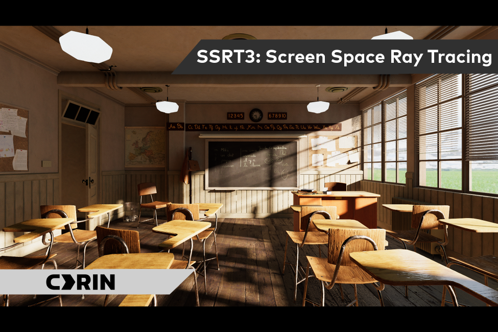
# SSRT 3

Real-time indirect diffuse illumination using screen-space information for HDRP. Like our previous implementations ([SSRT](https://github.com/cdrinmatane/SSRT)) the algorithm is based on GTAO and uses a horizon-based method to retrieve GI samples, which makes it a lot less noisy/blurry than HDRP's SSGI. Performance is also better than SSGI, at around 2-3 ms on an RTX 3060 for the entire effect. Our novel method bypasses the infinite thickness limitation typical of horizon-based methods and enables light to pass behind thin surfaces.

Fallback to Adaptive Probe Volumes (APV) or Reflection Probes (static or updated every frame) is used to gather lighting that is not present on the screen. This ensures that the illumination is stable no matter where the camera is looking.

# Features
* Multi-bounce indirect diffuse lighting and occlusion
* Support of emissive surfaces as an indirect light source
* Directional occlusion of ambient light (similar to bent normals, but handles thin surfaces better)
* Fallback to HDRP Ambient Probe Volumes (APV) and Reflection Probes for out-of-screen light

# Limitations
* Only works for HDRP (Tested on 2021.2.17f1, with HDRP 12)
* Only works in deferred mode

# Installation

Simply copy the SSRT folder into your project's Asset folder.

# Usage

1) Go to Edit->Project Settings, then "HDRP Global Settings", and add the "SSRT_HDRP" custom post effect to the "After Opaque And Sky" injection point.

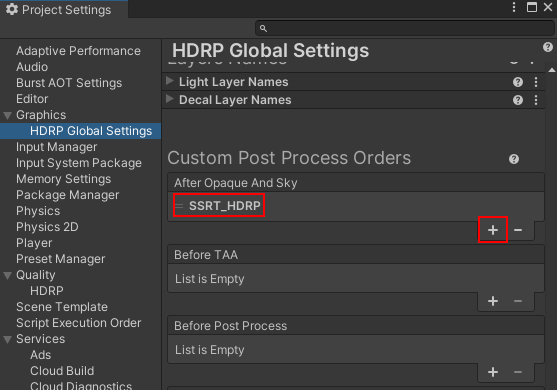

2) Add the "SSRT" post effect to a post-process volume.

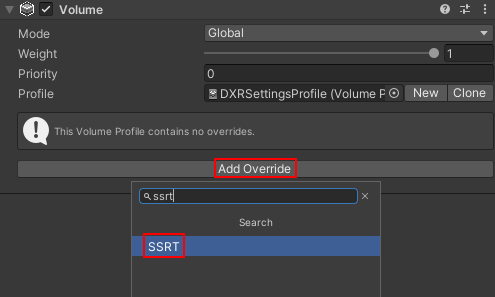

This plugin aims to replace all diffuse indirect lighting. It's highly recommended to disable all other sources of indirect light using the "Indirect Lighting Controller" override, by setting "Indirect Diffuse Lighting Multiplier" to 0:

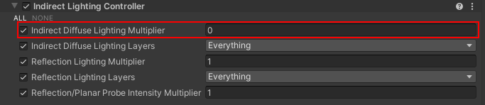

This is not mandatory though, and it may still give a visually pleasing result to keep existing diffuse sources (ie: lightmaps, etc).

# Properties

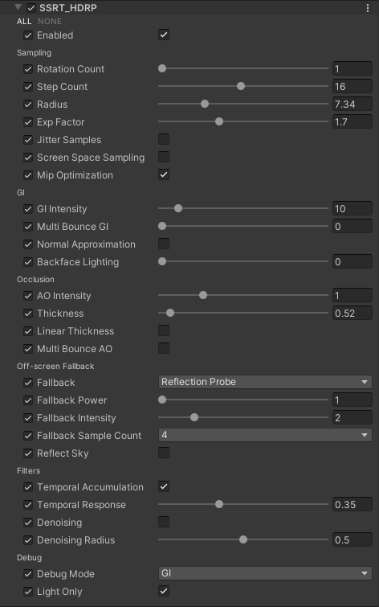

**Sampling**
* __Rotation Count:__ Number of per-pixel hemisphere slices. This has a big performance cost and should be kept as low as possible.
* __Step Count:__ Number of samples taken along one side of a given hemisphere slice. The total number of samples taken per pixel is rotationCount * stepCount * 2. This has a big performance cost and should be kept as low as possible.
* __Radius:__ Effective sampling radius in world space. AO and GI can only have influence within that radius.
* __Exp Factor:__ Controls sample distribution. Exp Factor is an exponent applied at each step get increasing step size over the distance.
* __Jitter Samples:__ Applies some noise on sample positions to hide the banding artifacts that can occur when there is undersampling.
* __Screen Space Sampling:__ Makes the sample distance in view space instead of world space (helps to have more detail up close).
* __Mip optimization:__ Use lower mip maps over the distance to use less GPU bandwidth.

**GI**
* __GI Intensity:__ Intensity of the indirect diffuse light.
* __Multibounce GI:__ Intensity of the light for second and subsequent bounces.
* __Normal Approximation:__ Guess what normal should be based on sample position. This avoids reading normals from the G-Buffer for every sample and saves some GPU bandwidth.
* __Backface lighting:__ How much light backface surfaces emit.

**Occlusion**
* __AOIntensity:__ Power function applied to AO to make it appear darker/lighter.
* __Thickness:__ Constant thickness value of objects on the screen in world space. Allows light to pass behind surfaces past that thickness value.
* __Linear Thickness:__ Increase thickness linearly over distance (avoid losing detail over the distance)
* __Multibounce AO:__ Multi-Bounce analytic approximation from GTAO.

**Off-screen Fallback**
* __Fallback:__ Source for off-screen lighting.
* __Fallback Power:__ Power function applied to ambient source to make it appear darker/lighter.
* __Fallback Intensity:__ Intensity of the ambient light coming from a fallback source.
* __Fallback Sample Count:__ Number of samples per rotation taken in the ambient source. Higer number can give more correct ambient estimation, but is more taxing on performance.
* __Reflect Sky:__ If enabled, ambient sampling done outside of the influence shape of the reflection probes will use the sky light instead (Used only when using reflection probe fallback).

**Filters**
* __Temporal Accumulation:__ Enable/Disable temporal reprojection.
* __Temporal Response:__ Controls the speed of the accumulation, slower accumulation is more effective at removing noise but can introduce ghosting.
* __Denoising:__ Enable/Disable diffuse denoiser.
* __Denoising Radius:__ Controls the radius of the GI denoiser.

**Debug**
* __Debug Mode:__ View the different SSRT buffers for debug purposes.
* __Light Only:__ If enabled only the radiance that affects the surface will be displayed, if unchecked radiance will be multiplied by surface albedo.

# Overview

SSRT 3 (for Screen Space Ray Tracing) aims to emulate path tracing and produce indirect illumination from screen pixels instead of scene geometry. It's very similar to Unity's SSGI, but much less noisy because it uses a horizon-based sampling method instead of ray marching the pixels. It's also faster than SSGI by about 25-50% depending on the settings used.

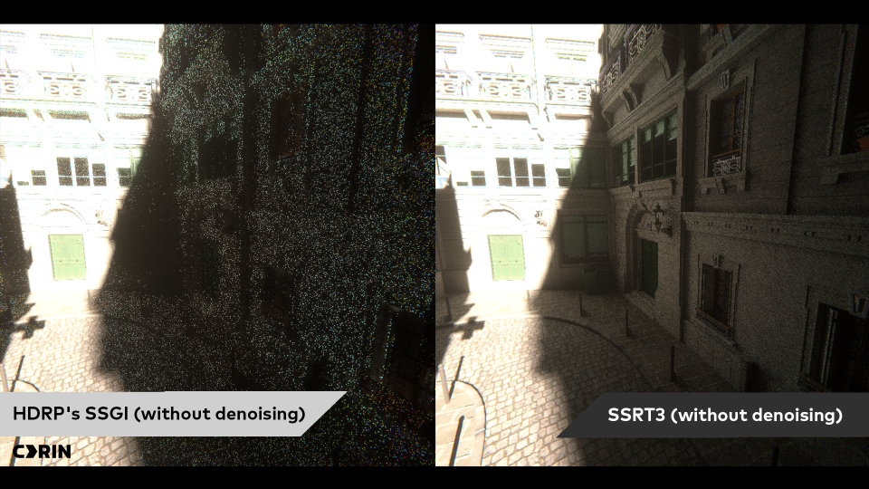
***Left:** Unity SSGI without denoising is very noisy. **Right:** SSRT also without denoising has much less noise.*

Ideally, the scene without SSRT should only contain direct lighting: real-time lights (with shadow maps) or emissive objects. It should look like the following image: 

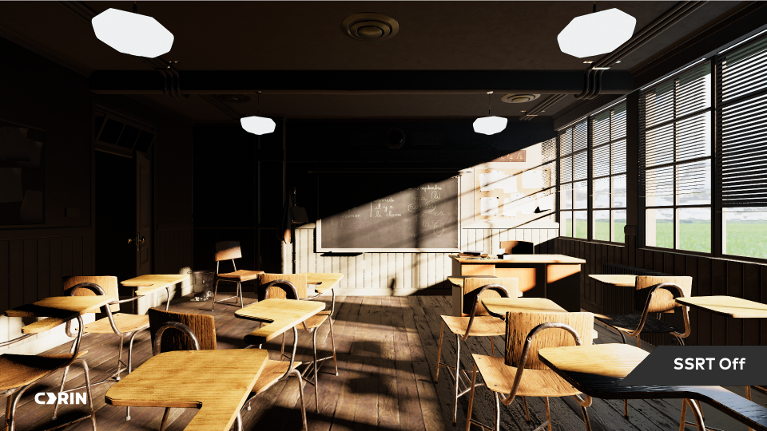

<!-- It's highly recommended to disable all other sources of indirect light using the "Indirect Lighting Controller" override, by setting "Indirect Diffuse Lighting Multiplier" to 0:

 -->

SSRT will generate the indirect lighting from screen pixels, and also from ambient sources like *adaptive probe volumes* and *reflection probes*. This will produce a final image that looks like this:

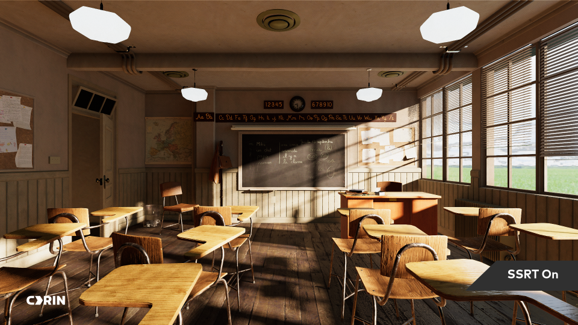

The indirect lighting only (without albedo) looks like this:

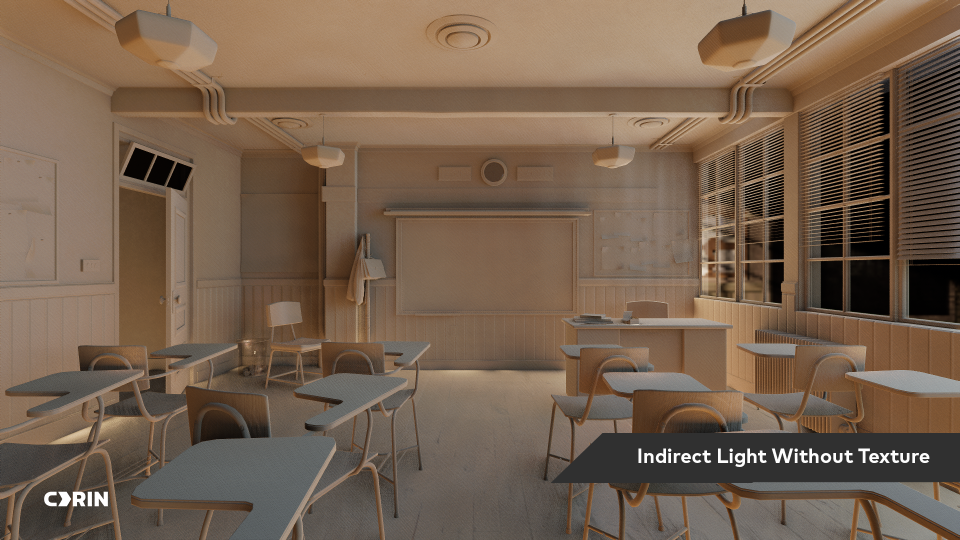

And the Ambient Occlusion:

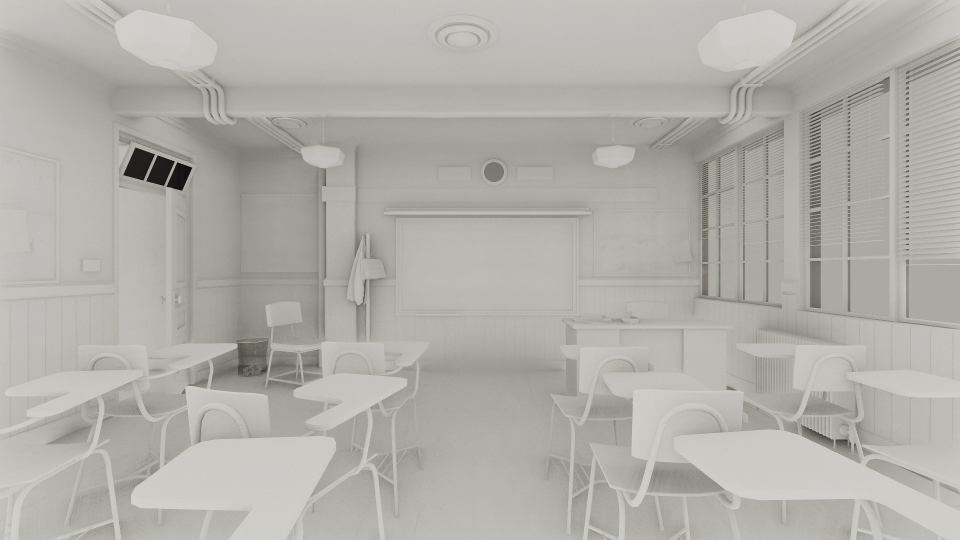

Emissive objects will generate light as if it was a dynamic area light, but if it exits the screen or gets occluded by an object, all the light will disappear:

SSRT samples along a certain number of hemisphere slices around the view vector (the number of slices corresponds to the ***Rotation Count*** property, and the number of samples per side corresponds to the ***Step Count*** property). The ***Exp Start*** and ***Exp Factor*** properties make the distance between samples grow exponentially the farther away they get from the current pixel.

<!-- | 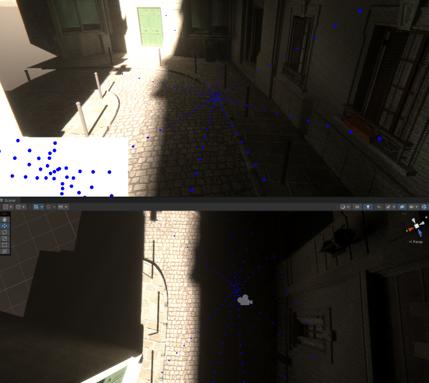 |
|:--:| 
| ***Top:** Debug view of the center pixel of the game screen using 4 rotations with 16 samples per side, using exponential spacing between samples. **Bottom:** Debug from an other point of view showing that screen samples are actually projected in the scene according to the depth buffer.* | -->

Each slice samples the depth buffer in screen space to detect occluders. Increasing the number of slices has a big cost on performance. For example, using 4 slices per pixel instead of 1 is roughly 4x more costly at runtime.

A common artifact that can happen if samples are too few (especially using exponential spacing) is banding:

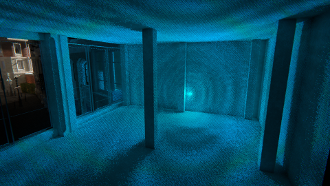

It happens because samples are all taken at the same distance around the current pixel. A good way to improve it is by checking the ***Jitter Samples*** property. This will randomly offset the sample position along the slice, and trade banding for more noise:

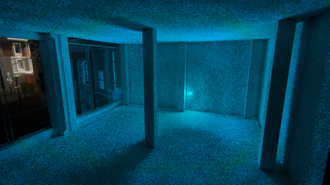

Fortunately the denoiser is able to remove most of the noise:

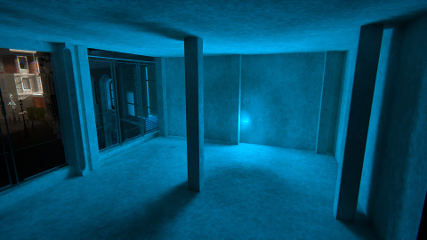

Note that the scene above is an extreme example where the emitter is very small and causes a lot of banding. Typically the artifact is a lot less pronounced.

<!-- Debugging one specific slice shows that samples are projected on the hemisphere slice and block some sectors. 

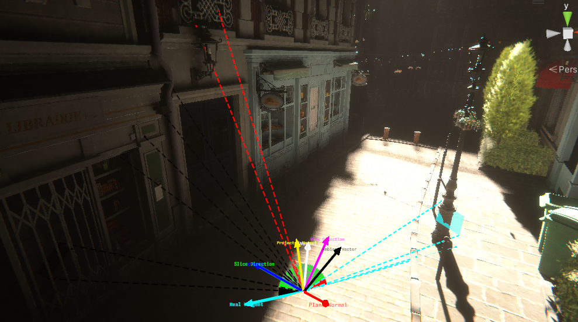

Usually horizon-based methods are limited to one maximum elevation per slice side so they cannot handle thin objects properly. To fix this, SSRT uses a 32-bit bitmask to detect which regions are occluded or can cast a light bounce. This later used to compute AO and GI.

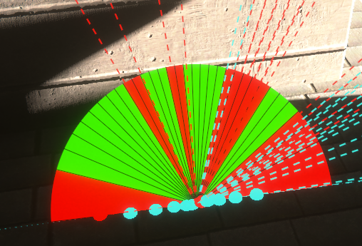 -->

# Credits
The following code has been developed at [CDRIN](https://www.cdrin.com/) by Olivier Therrien (R&D graphics programmer) with the help of Yannick Levesque (physics teacher at Cégep de Matane), and Clément Darnes (intern R&D programmer).

The Blender Classroom scene distributed with this plugin is under [CC0](https://choosealicense.com/licenses/cc0-1.0/) license, has been developed by Christophe Seux and comes from [here](https://www.blender.org/download/demo-files/).

# Acknowledgements

This project drew a lot of inspiration from the following work:

* [Multi-Scale Global Illumination](http://wili.cc/research/quantum_break/) in Quantum Break
* [GTAO](https://community.activision.com/t5/Publications/Practical-Real-Time-Strategies-for-Accurate-Indirect-Occlusion/ba-p/10002180) paper from Activision
* [GTAO](https://github.com/MaxwellGengYF/Unity-Ground-Truth-Ambient-Occlusion) implementation for Unity from MaxwellGengYF
* [HBIL](https://github.com/Patapom/GodComplex/blob/master/Tests/TestHBIL/2018%20Mayaux%20-%20Horizon-Based%20Indirect%20Lighting%20(HBIL).pdf) paper from Benoît "Patapom" Mayaux

